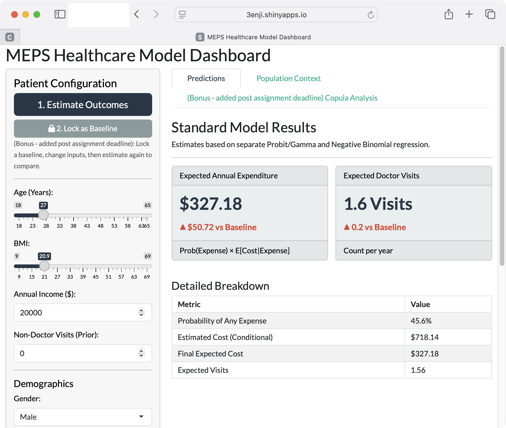
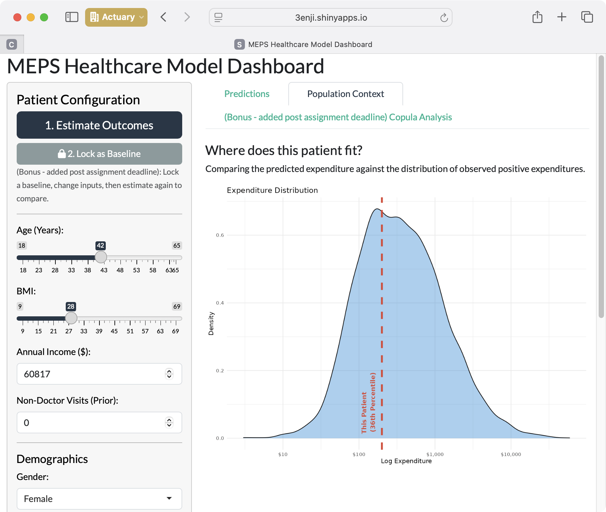
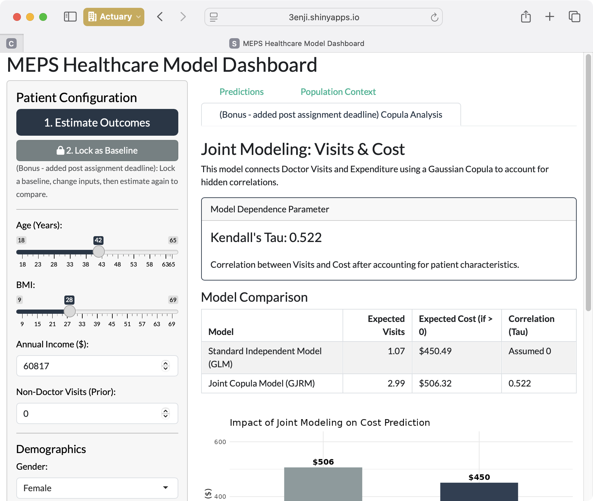

# MSc AS - Term 1: SMM634 Business Analytics — Individual Project

Term 1 individual project for Business Analytics (50% of coursework grade).

HTML report: https://ytterbiu.github.io/a_smm634-AS-individual-assignment/

## R Shiny App (basic dashboard)

> [!IMPORTANT] 
> Loading Time: The application runs a complex Joint Copula Model
> (from the `GJRM` package) in real-time upon startup. It may take up to 20
> seconds for the interface to load.

This interactive tool models healthcare outcomes using data from the Medical
Expenditure Panel Survey (MEPS) in 2012.

MEPS is a set of large-scale surveys of families and individuals, their medical
providers, and employers across the United States. It is the most complete
source of data on the cost and use of health care and health insurance coverage
in the U.S.

This dashboard is intended to make it easier to:

- **Simulate patients:** Configure demographic and clinical profiles (Age, BMI,
  Income, Chronic Conditions).
- **Predict outcomes:** Estimate annual medical expenditure and frequency of
  doctor visits.
- **Compare methodologies:** Evaluate differences between standard independent
  Generalised Linear Models (GLM) and advanced Joint Copula Models that account
  for the correlation between visits and costs.

### App / Dashboard outline

The R Shiny app is available via:

- https://3enji.shinyapps.io/smm634-meps-dashboard/

#### 1. Patient predictions (two-part model)

The main interface allows you to adjust patient characteristics and view
immediate predictions based on a standard Two-Part Model (Probit for probability
of expense, Gamma for cost).

A bonus feature (added after the assessment deadline) includes a "Lock Baseline"
feature to compare different scenarios side-by-side.



#### 2. Population Context

This tab visualises where the specific simulated patient fits within the broader
population. It plots the predicted expenditure against the density distribution
of actual positive expenditures from the MEPS dataset, providing a percentile
ranking.



#### 3. (Bonus - added after assessment deadline) Joint Copula Analysis

This module uses the
[`GJRM`](https://cran.r-project.org/web/packages/GJRM/index.html) package to
model Doctor Visits and Expenditure jointly using a Gaussian Copula. This
accounts for unobserved factors that influence both utilisation and cost
simultaneously (captured by Kendall's Tau), offering a more robust alternative
to independent modelling.



<!-- ## Structure

The directory structure is as follows

```{bash}
.
├── air.toml
├── Coursework Group 7.pdf
├── cs1-group07.ipynb
├── cs1-group07.r
├── cs1-group07.rmd
├── fig
│   ├── Element 1-1.svg
│   ├── ...
└── README.md
``` -->

## Requirements

- R (≥ 4.x)
- Packages: at minimum **rmarkdown** (others as used in the Rmd)

For R Markdown install core package:

```r
install.packages("rmarkdown")
```

---

### References

- **GJRM Package:** Marra, G., & Radice, R. (2017). _Generalised Joint
  Regression Modelling_. Available on CRAN:
  [https://cran.r-project.org/web/packages/GJRM/index.html](https://cran.r-project.org/web/packages/GJRM/index.html)
